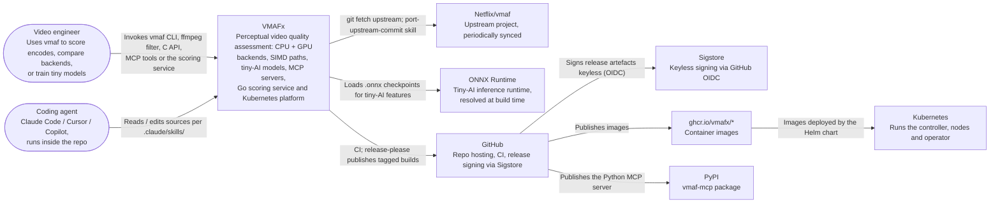

# C4 Level 1 — System context

This page shows who uses VMAFx and which external systems it depends on.
Start with the diagram, then use the table to look up each actor. See
[index.md](index.md) for the repository map and
[c4-container.md](c4-container.md) for Level 2.

!!! note "Status"
    This is a living overview. It was scaffolded on 2026-04-17 and extended
    to cover the container registry, PyPI and Kubernetes.

## What is C4?

[C4 model](https://c4model.com) by Simon Brown — four levels of increasing
detail: **Context → Container → Component → Code**. This page is Level 1;
deeper levels live in sibling files as the system grows.

## System context diagram

Mermaid has no native C4 shapes, so the diagram is a flowchart: rounded
boxes are people, the highlighted box is VMAFx, and plain boxes are external
systems.

## External actors and systems

| Actor / system | Role |
| --- | --- |
| Video engineer | Primary human user — scores encodes, compares backends, trains tiny models |
| Coding agent | Claude Code, Cursor, Copilot, etc. — operates inside the repo per AGENTS.md (compiled into vendor files such as CLAUDE.md) |
| Netflix/vmaf (upstream) | Origin of the codebase — periodic one-way syncs via `.claude/skills/sync-upstream/` |
| ONNX Runtime | Third-party dependency for tiny-AI inference, found at build time through pkg-config; builds without it return `-ENOSYS` from the tiny-AI entry points (see [ADR-0022](../adr/0022-inference-runtime-onnx.md)) |
| GitHub | Repo host + CI + release infrastructure (see [ADR-0037](../adr/0037-master-branch-protection.md)) |
| Sigstore | Keyless signing authority (see [ADR-0010](../adr/0010-sigstore-keyless-signing.md)) |
| ghcr.io/vmafx | Container registry for the published images (see [MCP release channel](../mcp/release-channel.md) and [publishing](../development/publishing.md)) |
| PyPI | Package index for the Python MCP server (see [MCP release channel](../mcp/release-channel.md)) |
| Kubernetes | Cluster that runs the Go controller, nodes and operator (see [operator](../server/operator.md)) |

## Key constraints at this level

- Upstream compatibility — Netflix golden tests are the numerical
  correctness gate ([ADR-0024](../adr/0024-netflix-golden-preserved.md)).
- Multi-backend one-binary — one `libvmaf` dispatches to CPU, CUDA, SYCL,
  HIP or Metal at runtime; build-time flags gate which are compiled in.
- Deployment target is C-only — the public API has no mandatory Python /
  C++ runtime dependency.

## Next level

- [c4-container.md](c4-container.md) — container view (libvmaf, tools/,
  ai/, mcp-server/, the Go platform binaries, model/, python/).
